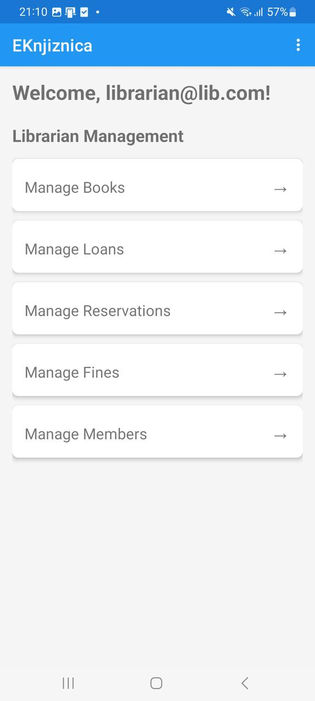
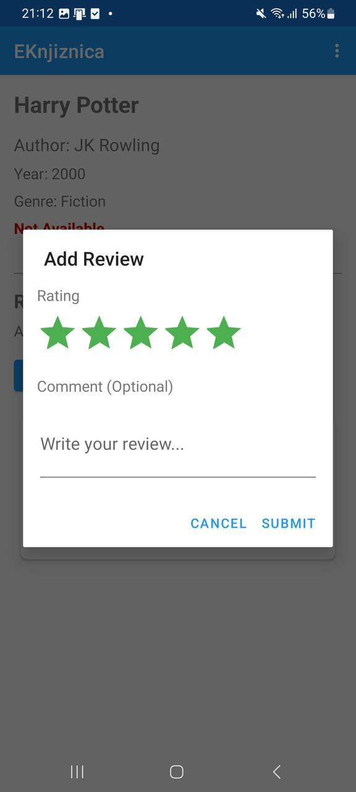
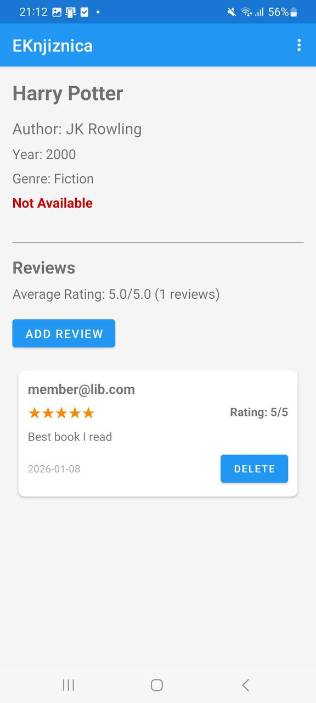
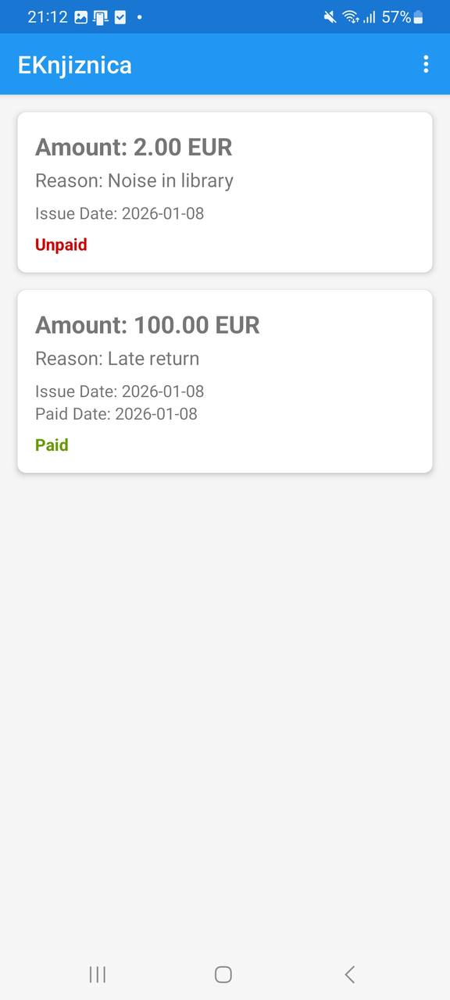
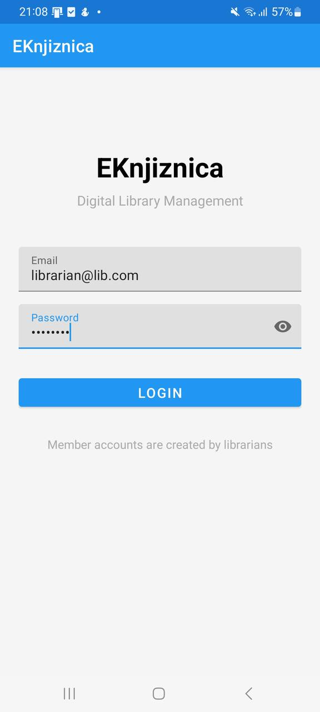

# EKnjiznica Mobile – Android aplikacija za člane knjižnice
## Informacijski sistemi

## Avtorji

- **70095915 - Miloš Mladenović**
- **63240392 - Luka Đorđević**


## Opis projekta

EKnjiznica Mobile je Android mobilna aplikacija za člane knjižnice, ki omogoča uporabnikom dostop do funkcionalnosti knjižnice preko mobilne naprave. Aplikacija komunicira z REST API-jem spletne aplikacije EKnjiznica.

## Tehnologije

- Java
- Android SDK
- Retrofit 2.9
- Gson
- Material Design Components

## Struktura projekta

```
EKnjiznica Mobile/
└── app/
    ├── src/main/java/
    │   ├── activities/  # Android aktivnosti
    │   ├── adapters/    # RecyclerView adapterji
    │   ├── api/         # API servisi
    │   ├── models/      # Modeli podatkov
    │   └── utils/       # Pomožne razrede
    └── src/main/res/    # Resursi
```

## Funkcionalnosti

### Za člane (Member)
- Pregled kataloga knjig
- Iskanje knjig
- Rezerviranje razpoložljivih knjig
- Pregled lastnih izposoj
- Pregled lastnih rezervacij
- Pregled glob
- Recenziranje knjig

## Screenshots












## API Endpoints

Aplikacija komunicira z REST API-jem spletne aplikacije:

### Avtentikacija
- `POST /api/AuthApi/login` - Prijava uporabnika
- `POST /api/AuthApi/register` - Registracija novega uporabnika

### Knjige
- `GET /api/BooksApi` - Seznam vseh knjig
- `GET /api/BooksApi/{id}` - Podrobnosti knjige

### Izposoje
- `GET /api/LoansApi/my` - Moje izposoje (Member)

### Rezervacije
- `POST /api/ReservationsApi/{bookId}` - Rezerviranje knjige (Member)
- `GET /api/ReservationsApi/my` - Moje rezervacije (Member)

### Globa
- `GET /api/FinesApi/my` - Moje globe (Member)

### Recenzije
- `GET /api/ReviewsApi/book/{bookId}` - Recenzije knjige
- `POST /api/ReviewsApi` - Kreiranje recenzije (Member)
- `GET /api/ReviewsApi/my` - Moje recenzije (Member)
- `DELETE /api/ReviewsApi/{id}` - Brisanje recenzije (Member)

## Privzeti uporabniki

**Član:**
- Registruju ih knjizničari preko spletne aplikacije

## Doprinos avtorjev

**Miloš Mladenović:** Integracija API servisa, models, deo activitesa

**Luka Đorđević:** UI/UX, layout datoteke, deo activitesa

## Deployment

API URL: `https://eknjiznica20260107181458.azurewebsites.net/`
